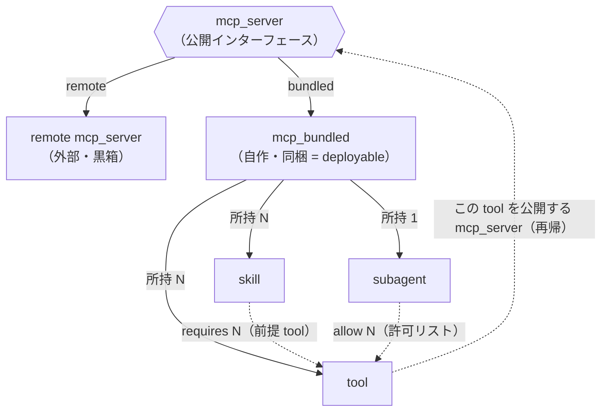
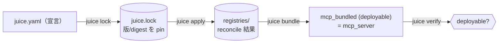
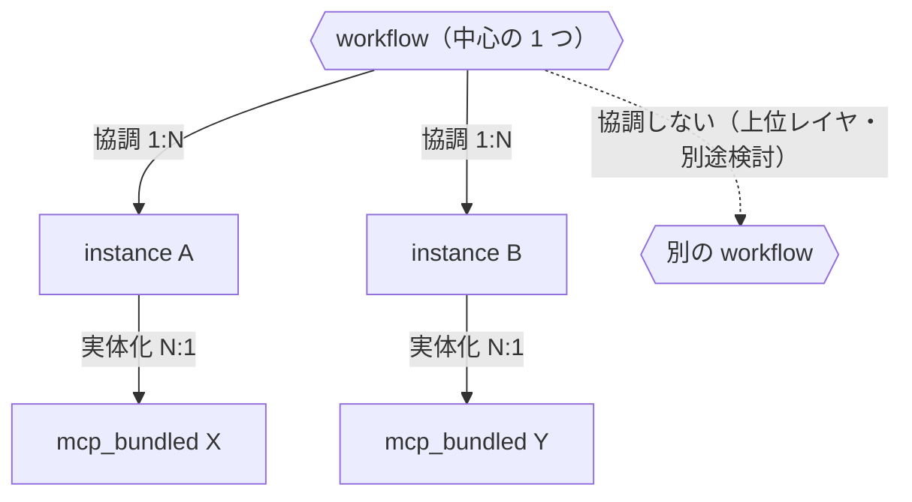

# juice

AI エージェントのパッケージマネージャー。各レイヤを **テンプレート**として宣言し、
最終的に **deployable な mcp_bundled** を 1 つ組み上げる。詳細は
[docs/workspace.md](docs/workspace.md) / [docs/build.md](docs/build.md)。

> **`mcp_bundled (deployable) = mcp_server`。** `mcp_server`（公開インターフェース）には
> **remote**（外部参照）と **bundled**（自作＝同梱）の 2 実現がある。`mcp_bundled` は依存一式を
> vendoring・ビルドし、変数の既定値・secret 参照を抱えた、自己完結したデプロイ単位。

## レイヤ間の関係

始発点は **公開インターフェースである `mcp_server`**。これには **remote**（外部・黒箱）と
**bundled = `mcp_bundled`**（自作・同梱）の 2 種類がある。bundled は subagent / skill / tool を
所持する。そして **その tool を公開しているのも、また 1 つの mcp_server**（remote or 別の
mcp_bundled）。だから tool をたどると先頭の mcp_server に戻る＝**再帰**（底は remote）。

> **包含制約:** `skill.requires ⊆ subagent.allow ⊆ mcp_bundled.provides`
> （手順が呼ぶ tool ⊆ 許可された tool ⊆ 実体が提供される tool）。`verify` がこれを検査する。

| 関係 | 多重度 | 意味 |
|------|--------|------|
| mcp_server → 実体 | 1 : 1 | remote（外部）か bundled（= mcp_bundled）のいずれか |
| mcp_bundled → subagent | **1 : 1** | 脳は 1 つ |
| mcp_bundled → skill | **1 : N** | 手順を複数所持 |
| mcp_bundled → tool | **1 : N** | tool を複数所持 |
| skill → tool | **N : M** | 手順が呼ぶ前提 tool（requires）。`skill.requires ⊆ subagent.allow` |
| subagent → tool | **1 : N** | 使ってよい tool の許可リスト |
| tool → mcp_server | N : 1 | その tool を公開している mcp_server（remote or 別の mcp_bundled）＝再帰 |

- **mcp_server = 公開インターフェース。** remote でも bundled でも、消費側からは同一に見える。
- **remote** … 既存の MCP server を黒箱として参照（実体は内包せず digest で pin）。
- **bundled（mcp_bundled）** … subagent / skill は内包（vendoring）、tool は別の mcp_server が公開（再帰）。

## 関係の 2 レベル（参照 vs バンドル）

混同しやすいので分けて捉える。

| 関係 | レベル | 多重度 | 目的 |
|------|--------|--------|------|
| skill / mcp_server を複数 mcp_bundled が使う | **参照**（authoring） | **N : M** | 再利用・共有 |
| 1 mcp_bundled が抱える subagent / skill / tool | **バンドル**（build） | **1 : N（包含）** | **deployable 化（vendoring）** |

→ 参照レベルでは共有（N:M）だが、**bundle 時に包含ツリー（1:N）へ畳んで vendoring** し、
mcp_bundled を自己完結＝ deployable な mcp_server にする。

## deployable までのパイプライン

- **lock** … 参照パッケージ/registry の版・digest を pin（再現性の本体）。
- **apply** … manifest を registry へ冪等 reconcile（依存順に下層から）。
- **bundle** … mcp_bundled の依存一式を vendoring・ビルドし、変数既定値を確定 → deployable 化。
- **verify** … 未解決依存・既定値未設定の変数を検出して deployable か判定。

> deploy / 起動そのものはこのパイプラインの外（次工程）。ここでは「いつでもデプロイできる
> 成果物（＝deployable な mcp_bundled＝mcp_server）」を作るところまでを範囲とする。

## workflow（実行・協調レイヤ：別軸）

mcp_bundled の関係図とは**別軸**（こちらは実行時の協調）。**instance = mcp_bundled を実体化
したもの**（image → container の container 相当）。**1 つの workflow が複数の instance を協調
動作**させる。**workflow 同士は協調しない**（必要ならさらに上位レイヤの話。別途検討）。

| 関係 | 多重度 | 意味 |
|------|--------|------|
| workflow → instance | **1 : N** | 複数 instance を協調動作させる |
| instance → mcp_bundled | **N : 1** | mcp_bundled を実体化したもの（1 bundled → 複数 instance） |
| workflow ↔ workflow | — | 協調しない（上位レイヤ。別途検討） |

> **image / container 類比:** mcp_bundled = image（deployable 成果物）、instance = container（実体）。
> workflow はその container 群を協調させる実行レイヤ。
