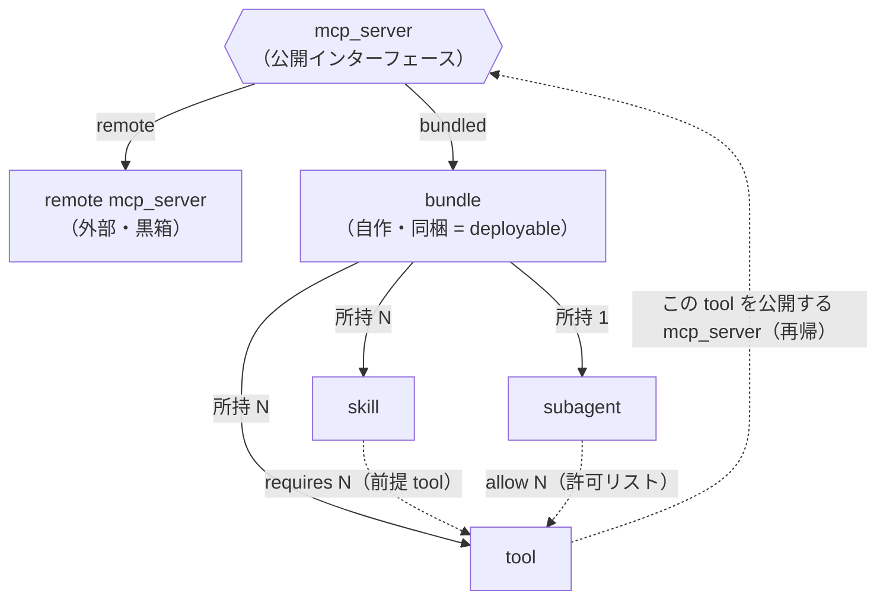
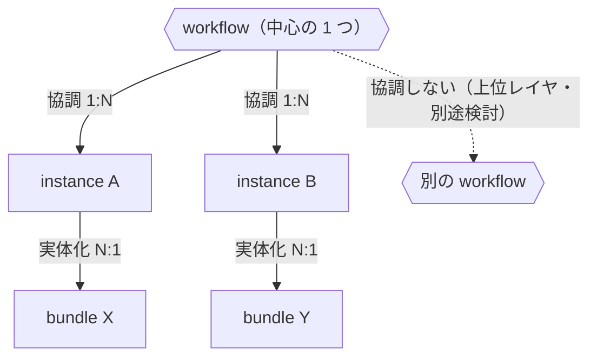

# アーキテクチャ（レイヤ関係）

> **juice の位置づけ:** AI エージェントのための**宣言的パッケージマネージャー＋デリバリ・パイプライン**。
> 1 つの spec（`juice.yaml`）から「動かせる成果物」（registries / image / compose・k8s manifest）まで
> 生成する。juice 自身は**ワークロードを実行せず**、実行基盤（docker / k8s＋ArgoCD / cron）に委譲する
> （配備を定期実行する juice 内蔵スケジューラ＝コントロールプレーンは将来構想）。現状は AI エージェント
> に特化（リファレンス・フレーバー＝チャット）だが、機構は組織内資産（dataset / model / 知識）へ一般化
> しうる（構想）。製品像は [README](../README.md)。

> juice の全体像を **2 軸** で捉える。
> 1. **概念モデル** … mcp_server / bundle / subagent / skill / tool の関係（本書前半）。
> 2. **宣言的ワークスペース** … その概念モデルを `juice.yaml` 1 ファイルで宣言し、
>    `lock → plan → apply` で registries へ具現化するライフサイクル（本書「[宣言的ワークスペース](#宣言的ワークスペースjuiceyaml)」節）。
>
> 同じレイヤ群を「関係（概念）」と「宣言（運用）」の別表現で見ているだけで、両者は対応する。
> 実装の使い方は [README](../README.md)、ビルド手順は [build.md](build.md) を参照。
> 旧設計の宣言案 [workspace.md](workspace.md)（SUPERSEDED）が `juice.yaml` 系の出発点で、
> 現行で実装された範囲を本書「宣言的ワークスペース」節に反映する。

`bundle (deployable) = mcp_server`。`mcp_server`（公開インターフェース）には
**remote**（外部参照）と **bundled**（自作＝同梱）の 2 実現がある。`bundle` は依存一式を
vendoring・ビルドし、変数の既定値・secret 参照を抱えた、自己完結したデプロイ単位。

## レイヤ間の関係

始発点は **公開インターフェースである `mcp_server`**。これには **remote**（外部・黒箱）と
**bundled = `bundle`**（自作・同梱）の 2 種類がある。bundled は subagent / skill / tool を
所持する。そして **その tool を公開しているのも、また 1 つの mcp_server**（remote or 別の
bundle）。だから tool をたどると先頭の mcp_server に戻る＝**再帰**（底は remote）。



> **包含制約:** `skill.requires ⊆ subagent.allow ⊆ bundle.provides`
> （手順が呼ぶ tool ⊆ 許可された tool ⊆ 実体が提供される tool）。

| 関係 | 多重度 | 意味 |
|------|--------|------|
| mcp_server → 実体 | 1 : 1 | remote（外部）か bundled（= bundle）のいずれか |
| bundle → subagent | **1 : 1** | 脳は 1 つ |
| bundle → skill | **1 : N** | 手順を複数所持 |
| bundle → tool | **1 : N** | tool を複数所持 |
| skill → tool | **N : M** | 手順が呼ぶ前提 tool（requires）。`skill.requires ⊆ subagent.allow` |
| subagent → tool | **1 : N** | 使ってよい tool の許可リスト |
| tool → mcp_server | N : 1 | その tool を公開している mcp_server（remote or 別の bundle）＝再帰 |

- **mcp_server = 公開インターフェース。** remote でも bundled でも、消費側からは同一に見える。
- **remote** … 既存の MCP server を黒箱として参照（実体は内包せず `package`/`version` で参照）。
- **bundled（bundle）** … subagent / skill は内包（vendoring）、tool は別の mcp_server が公開（再帰）。

## 関係の 2 レベル（参照 vs バンドル）

混同しやすいので分けて捉える。

| 関係 | レベル | 多重度 | 目的 |
|------|--------|--------|------|
| skill / mcp_server を複数 bundle が使う | **参照**（authoring） | **N : M** | 再利用・共有 |
| 1 bundle が抱える subagent / skill / tool | **バンドル**（build） | **1 : N（包含）** | **deployable 化（vendoring）** |

→ 参照レベルでは共有（N:M）だが、**bundle 時に包含ツリー（1:N）へ畳んで vendoring** し、
bundle を自己完結＝ deployable な mcp_server にする。

## bundle/build/run（実装の対応）

現在の実装では、宣言（`bundle.yml`）→ `bundle`（vendoring ＋ LangGraph 一式生成）→ `build`
（docker イメージ）→ `run`（api / ui / mcp_server）という流れ。`run` は LangGraph で LLM と
MCP server を連携した会話エージェントを起動する。詳細は [build.md](build.md)。

## 宣言的ワークスペース（juice.yaml）

上の概念モデル（mcp_server / subagent / skill / tool / bundle）を、`bundle.yml` のように
1 つの bundle 単位ではなく、**全レイヤを 1 ファイル `juice.yaml` で宣言**する軸。Kubernetes と
同じく **desired state を宣言 → `apply` で reconcile** する考え方で、`juice.yaml` が唯一の正
（source of truth）。`registries/` は手で書く一次情報ではなく、apply の**出力先**（生成物）。

```
juice.yaml ──lock──▶ juice.lock（解決＋manifestDigest）──plan──▶ 差分 ──apply──▶ registries/（冪等 reconcile＋prune）
```

| 段階 | コマンド | 何をする | 実装 |
|------|----------|----------|------|
| 解決 | `juice lock`     | manifest を解決し版/digest と `manifestDigest` を冪等に pin | `src/core/lock.py`（C002） |
| 差分 | `juice plan`     | apply の dry-run。registries に与える変更だけ表示          | apply の dry-run 昇格（C005） |
| 反映 | `juice apply`    | 依存順に registries へ materialize、宣言外は prune（冪等）  | `src/core/apply.py`（C003） |
| 検証 | `juice manifest validate` | 構造・相互参照・version 制約を検証                 | `src/core/manifest.py`（C001/C006） |

`apply` は **依存順（mcp_server → skill / subagent → bundle → instance → workflow → schedule）** に
下層から reconcile する（概念モデルの「下位層に依存」と同じ向き）。manifest パーサ（manifest.py）は
registry / storage に依存しない独立モジュールで、層の分離を保つ。

逆向きに、**宣言（workflow / schedule）から依存物を遡って解決**できる（`deploy.dependency_closure`）。
schedule/workflow の steps が参照する bundle を起点に、その subagent / skill / tool まで辿る。
**ビルド対象は bundle**（`bundle` が依存を vendoring して image 化）で、`juice workflow build` /
`juice schedule build` は生成時にこの「遡った build 対象」を表示する。`--build-deps` を付けると closure の
bundle を宣言順に `bundle → build`（docker）まで起動する（既定 off）。

**vendored workflow（終端・外部スタック）:** workflow には steps から生成する型のほかに、registry の
`workflows/<name>/docker-compose.yml` を**直に同梱する終端ノード**がある（例: `langfuse`）。juice の bundle に
依存しない（dependency closure は空）外部スタックを「そのまま持つ」形で、`juice workflow build <name>` は
生成せず同梱 compose を `deploy/<name>/` へ **passthrough** する。juice の本質は依存解決なので、依存物が無い
ものは終端としてこのレイヤに置けばよい（`bundle` の MCP バンドラーを通さない経路）。`index.md` に
`vendored: compose` を持ち、registry の健全性検査（name=dir / OKF type）は通常どおり通る。※現状は registry に
**手で置く**前提（juice.yaml manifest 管理＝apply の prune 対象ではない）。manifest からの宣言管理は将来。

### 概念モデルと宣言の対応

`juice.yaml` の各キーは、前半の概念モデルのレイヤに 1:1 で対応する（**同じレイヤの別表現**）。

| 概念モデル | juice.yaml のキー | 補足 |
|------------|-------------------|------|
| mcp_server（公開インターフェース） | `mcp_servers:` | tool の提供元。remote / bundled の両実現 |
| subagent | `subagents:` | 脳（1 bundle に 1 つ） |
| skill    | `skills:`    | 手順 |
| tool     | mcp_server の `tools:` ＋ bundle の `tools[].from` | 公開は mcp_server、結線は from |
| bundle（deployable） | `bundles:` | subagent + skill + tool を結線 |
| instance（実体化） | `instances:` | 変数既定値・secret 参照を与えた具象（workflow 協調の単位） |
| workflow（常駐の協調） | `workflows:` | `steps[].bundle` を**常駐**させる定義（時間非依存）。`schedule` は持たない |
| schedule（定期実行） | `schedules:` | `schedule`（cron）＋ `steps[]`。**いつ動かすか**を持つトリガ（scheduler の責務） |

> **registry のみのレイヤ（manifest 非対象）:** `python_packages`（PyPI 様の registry。layer=registry）は
> `juice.yaml` のキーを持たない＝`apply` の materialize/prune 対象ではない（langfuse の vendored workflow と同様、
> registry に直接置く）。ただし `config.LAYERS` 登録済みで `all list` / `python_package list` / `registry verify`
> （name=dir）/ `registry index` の横断対象。エントリは純 YAML `index.yml`（OKF 検査外）。wheel 格納や
> PEP 503 風 index 提供はまだ未実装（YAGNI）。同じ枠で将来 `datasets` 等も同列に足せる。

### mcp_server: local（同梱）と remote（外部参照）（E002）

`mcp_servers:` の 1 エントリは 2 形態のいずれか。消費側（subagent の `allow_tools` / bundle の
`tools[].from`）からは**どちらも同じ `mcp_server`** として見え、結線の書き方（`from: mcp_server:<name>`）
は変わらない（remote は bind の新 kind ではなく、提供元 server の属性）。

| 形態 | 宣言 | transport | materialize（`tools/<name>/index.md`） | vendoring |
|------|------|-----------|----------------------------------------|-----------|
| **local（同梱）** | `command:` | stdio | `command` / `args` / `env` | する（パッケージ丸ごと） |
| **remote（外部参照）** | `url:`（＋任意 `transport:`） | `streamable_http`（既定）/ `sse` | `transport` / `url` / `env` | **しない**（黒箱） |

- `command` と `url` は**排他**（local か remote のどちらか）。`transport` を remote 以外で単独宣言するのは不整合でエラー。
- remote は juice が実体を持たない黒箱なので **bundle に vendoring されない**。build で生成される
  `agent.json` の接続定義は `{transport, url}`（local の `{command, args}` と対）になり、graph.py は
  url で接続する（`langchain-mcp-adapters` の HTTP transport）。
- lock は remote の `url` / `transport` も記録する（`lockVersion: 2`）。

### version / 制約 / drift（再現性の補助線）

- **version（C004）** … 各パッケージ Spec に任意の SemVer を付与（`src/core/semver.py`、外部依存なし）。
  lock は mcp_server の `version` を記録し `manifestDigest` に反映する。
- **制約参照（C006）** … tool 束縛の `from: mcp_server:weather@>=1.0.0` を validate で充足チェック
  （`satisfies`）。`@` 無しは従来どおり（後方互換）。範囲マッチ・複数版共存の依存解決はまだ持たない。
- **lock drift（C005）** … apply は `juice.lock` の `manifestDigest` と spec を照合し drift を検出
  （既定は警告、`--frozen` でエラー、`--require-lock` で lock 不在をエラー）。
  これは「生成物を焼かず spec から再生成し、整合性は digest で担保する」設計原則の実装。
- **registry の健全性（E004）** … `juice registry verify` が registries の 3 点を検査する
  （`src/core/metadata.py` / `index.py`）。(1) **name=dir** … メタデータの `name` がディレクトリ名と
  一致するか。(2) **OKF 適合** … `.md` の concept document（tool / skill / subagent / workflow）が
  [OKF（Open Knowledge Format）](https://github.com/GoogleCloudPlatform/knowledge-catalog) 必須の
  非空 `type` を持つか。`type` は OKF 標準の concept type（tool は `mcp-server`）、`kind` は juice の
  レイヤ分類で併記する。純 YAML マニフェスト（bundle / instance）は OKF の `.md` ではないため対象外。
  (3) **index drift** … メタデータ索引（`juice.index.yml`、生成物）が registry と一致するか（digest 照合）。
  いずれも**検出して報告するだけ**で自動修正はしない（コピー流用か移動かを機械判断できないため人間に委ねる）。
- **okf_catalog_cache（OKF メタデータの AI 向け派生ビュー：周辺機能）** … `juice okf-cache` がレイヤ横断で
  各資産の OKF メタデータを一覧する（`src/core/okf_catalog_cache.py`）。新しい registry レイヤではなく、
  index の集約（`build_index`）を土台に各資産を**標準スキーマ**（identity＝`name`/`layer` ＋ OKF `type` ＋
  OKF 推奨フィールド `title`/`description`/`tags`/`resource`/`timestamp`）へ射影した**ビュー**。推奨フィールドは
  任意で欠落は省略（verify を壊さない）。`--type <concept type>`（tool は `mcp-server`）・`--tag <tag>` で絞り込める。
  index を再発明せず使う（設計原則）。**用語注意:** juice のコア概念 **catalog**（成果物の構造インベントリ＝
  namespace/kind/name）とは別物で、OKF 由来・不安定・AI 連携用の周辺機能。区別は [glossary.md](glossary.md) 参照。

> bundle.yml ベースの現行パイプライン（[build.md](build.md)）と juice.yaml ベースの宣言系は
> **別系統**。前者は 1 bundle を deployable にする手順、後者はワークスペース全体の desired state を
> 宣言・収束させる軸。詳細・未決の論点は [workspace.md](workspace.md)（SUPERSEDED だが宣言設計の出発点）。

## workflow（実行・協調レイヤ：別軸）

bundle の関係図とは**別軸**（こちらは実行時の協調）。**instance = bundle を実体化
したもの**（image → container の container 相当）。**1 つの workflow が複数の instance を協調
動作**させる。**workflow 同士は協調しない**（必要ならさらに上位レイヤの話。別途検討）。



| 関係 | 多重度 | 意味 |
|------|--------|------|
| workflow → instance | **1 : N** | 複数 instance を協調動作させる |
| instance → bundle | **N : 1** | bundle を実体化したもの（1 bundled → 複数 instance） |
| workflow ↔ workflow | — | 協調しない（上位レイヤ。別途検討） |

> **image / container 類比:** bundle = image（deployable 成果物）、instance = container（実体）。
> workflow はその container 群を協調させる実行レイヤ。

> **定義とトリガの分離（重要）:** 「何を動かすか（workflow）」と「いつ動かすか（schedule）」を分ける。
> k8s の Deployment↔CronJob、Argo の WorkflowTemplate↔CronWorkflow と同型。`schedule` は workflow の
> 持ち物ではなく、**scheduler の持ち物＝別概念 `schedules:`**（`ScheduleSpec`）。
> - **workflow**（`workflows:` / `WorkflowSpec`）… 複数 bundle を**常駐**させる定義（時間非依存）。
>   `apply` が `workflows/<name>/index.md`（frontmatter kind/name/type/steps）へ materialize。
> - **schedule**（`schedules:` / `ScheduleSpec`）… `schedule`（cron）＋ steps で**定期実行**を宣言するトリガ
>   （ワークロード・ジョブ）。`apply` が `schedules/<name>/index.md`（kind/name/type/schedule/steps）へ materialize。
>
> **実行モデル（E001 第二〜四歩）:** juice は **実行しない**。宣言から実行基盤が食える**デプロイ成果物を生成**
> する（`src/core/deploy.py` / CLI `juice workflow build` / `juice schedule build`）。常駐・協調・監視・定期実行は
> 外部基盤（compose / k8s＋ArgoCD / 外部 cron）に委譲する。**target は pluggable**（`compose` / `k8s`）：
> - **workflow → compose**：`deploy/<name>/docker-compose.yml`。各 step の image（規約 `juice/<name>[:version]`）を
>   長期常駐 service（`restart: unless-stopped`）に。`input`→env、label `juice.workflow`。
>   step 間は **宣言順の直列 `depends_on`**（2 番目以降が直前の service に依存。先頭は持たない）。
> - **workflow → k8s**：`manifests.yaml`（multi-doc）。各 step を **Deployment**（replicas:1）に。
>   k8s には `depends_on` 相当が無いので**順序は持たない**（必要なら Argo 等で別途）。
> - **schedule → k8s**：各 step を **CronJob**（`schedule` を cron に）。
> - **schedule → compose**：compose に cron は無いので自動起動しない one-shot service（`restart: "no"`＋
>   `profiles: [scheduled]`、cron は label）。外部 cron が `docker compose run` で起動する想定。
>
> **step 協調の現状:** workflow/compose の `depends_on` は compose の意味での**起動順**にすぎず、「完了待ち」
> ではない。pipeline 的な完了待ち・データ受け渡し・DAG（直列でなく分岐）・実起動（`up`/`kubectl apply`）・
> スケジューラ稼働は次段階（YAGNI）。compose 以外（k8s / schedule）の step は独立リソースのまま。
>
> **ライフサイクル・フック（`workflows[].hooks`）:** 配備の前後に bundle を **1 回だけ**走らせる宣言
> （Helm のフックと同型）。`{event: pre_deploy|post_deploy, bundle, input?}`。juice は実行せず**成果物に焼き込む**:
> - **compose** … one-shot service（`restart: "no"`、label `juice.hook`）。**pre_deploy** は先頭 step が
>   `depends_on: {condition: service_completed_successfully}` で待つ（compose が真に完了待ちを保証できる唯一の経路）。
>   **post_deploy** は末尾 step の起動後（`service_started`）に走る。
> - **k8s** … 各フックを **Job**（`restartPolicy: OnFailure`）に。k8s には depends_on 相当が無いので
>   **順序は static manifest だけでは保証されない**（Helm hook / ArgoCD sync-wave 等で別途。`juice.hook` ラベルが目印）。
>
> `manifest.validate` は hook.bundle の参照存在も検査する。フックと step は 1 回の命名で通すため service 名が衝突しない。

> **スケジューラの 2 ターゲット（分類）:** 「何を定期実行するか」で 2 種に分かれる。
> - **(A) ワークロード・ジョブ**（データプレーン）… デプロイ済みコンテナを定期実行する。**`schedules:` がこれ**
>   （k8s CronJob ／ docker は cron 非対応なので外部 cron＋one-shot）。**実装済（生成のみ）**。
> - **(B) パイプライン・トリガ**（コントロールプレーン）… juice の**配備操作**（apply / redeploy 等）を定期実行する。
>   将来の **`triggers:`** ＋ **juice 内蔵スケジューラ（デーモン）** で実現する**構想（未実装）**。ArgoCD 本体が
>   常駐して定期 sync するのと同型で、ワークロードを動かす (A) とは実行主体も生成物も別。
>
> juice の「**ワークロードは実行しない**」原則は (A) に適用される。(B) はコントロールプレーンの常駐であり
> ワークロードではないため原則と矛盾しない（運用面〔状態の永続化・missed run・HA〕は実装時に設計）。
> 詳細・課題は [PROJECT.md](../PROJECT.md) の E005 を参照。
